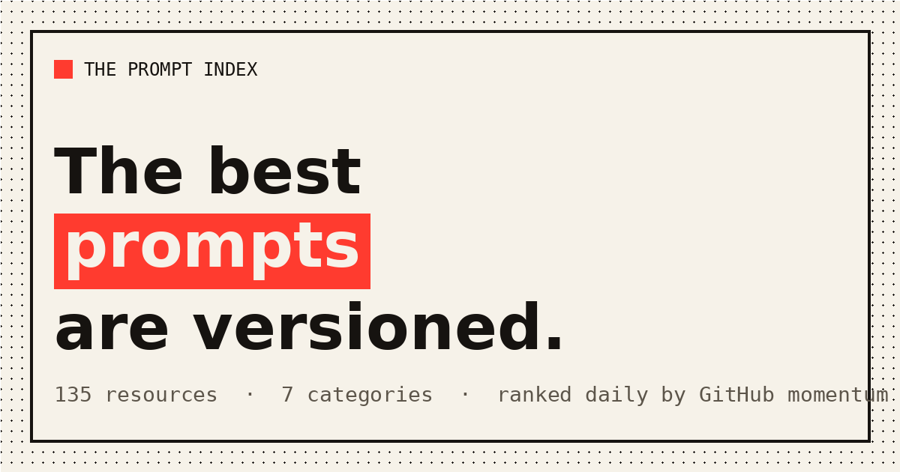

<div align="center">

# The Prompt Index

### The best prompts are version-controlled.

[](https://prompt.kymatalabs.com)
&nbsp;

&nbsp;

&nbsp;


<a href="https://prompt.kymatalabs.com"></a>

**[Open the live index →](https://prompt.kymatalabs.com)**

</div>

---

## What it is

**The Prompt Index** is a living, self-updating directory of prompt-engineering resources — curated collections, system prompts, optimizers, frameworks, and guides.

Every repository is ranked by **momentum** — not by total stars, and not by who paid for placement.
The whole index is **recomputed every day** from live GitHub signals and republished automatically.
No editors, no vendor decks, just the signal.

> 🔗 **Live:** [prompt.kymatalabs.com](https://prompt.kymatalabs.com) · part of [**The Living Indexes**](https://indexes.kymatalabs.com)

## Features

- 📊 **Momentum ranking** — a 0–100 score blending stars, push-recency, and how fast a repo is rising
- 🔄 **Self-updating** — a daily GitHub Action recomputes and redeploys; the index is never stale
- 🗂 **7 categories** — `Optimization & Tooling` · `Prompt Packs` · `System Prompts` · `Collections` · `Guides & Courses` · `Image & Multimodal` · `Frameworks`
- 🔎 **Instant search, filter &amp; sort** — by momentum, stars, or newest, fully client-side
- 📄 **An SEO landing page for every entry** — title, meta, canonical, Open Graph, and `SoftwareSourceCode` JSON-LD
- 🌗 **Light &amp; dark themes**, RSS feed, and an `llms.txt` for AI crawlers

## How it works

```
build_data.py   →   data.json   →   gen_details.py   →   deploy.py   →   ⟳ daily cron
 (GitHub API)       (the index)     (per-entry pages)    (Vercel REST)    (GitHub Action)
```

1. **`build_data.py`** searches GitHub across several queries, de-duplicates, **filters to real
   resources** (precision over recall — a directory you can trust beats a noisy dump), categorizes,
   and scores each by momentum → writes `data.json` + the SEO surfaces (`sitemap.xml`, `rss.xml`,
   `robots.txt`, `llms.txt`).
2. **`gen_details.py`** renders one fully-SEO'd landing page per entry under `p/<slug>/`.
3. **`gen_og.py`** renders the Open Graph share card.
4. **`deploy.py`** ships the static site to Vercel via the REST API.
5. A **daily GitHub Action** runs the whole pipeline and redeploys — so the index reflects the
   ecosystem as it is *today*.

### How momentum is scored

```
momentum = 0.55 · log-scaled stars   (popularity, compressed so giants don't flatten everything)
         + 0.32 · push recency       (full credit if pushed today, decaying to zero by ~180 days)
         + 0.13 · rising-newness     (a bonus for young repos gaining stars fast)
```

A repo that shipped a release this week outranks a bigger repo that's gone quiet — momentum, not legacy.

## Run it locally

```bash
GITHUB_TOKEN=ghp_xxx  python3 build_data.py   # recompute the index from live GitHub signals
python3 gen_details.py && python3 gen_og.py    # render the per-entry pages + OG card
python3 -m http.server 8080                    # open http://localhost:8080
```

No build step, no framework — static HTML/CSS/JS by design, so it loads instantly and hosts anywhere.

## Tech

`Python` (data pipeline) · static `HTML/CSS/JS` (no framework) · `Vercel` (hosting) ·
`GitHub Actions` (daily cron) · the **GitHub Search API** as the single source of truth.

## Part of The Living Indexes

This is one of a fleet of self-updating indexes mapping the AI-builder ecosystem:

- [The Skill Index](https://skill.kymatalabs.com)
- [The Eval Index](https://eval.kymatalabs.com)
- [The Local LLM Index](https://localllm.kymatalabs.com)
- [The RAG Index](https://rag.kymatalabs.com)
- [The Fine-Tuning Index](https://finetune.kymatalabs.com)
- [The Living Indexes (hub)](https://indexes.kymatalabs.com)

→ See them all on [**indexes.kymatalabs.com**](https://indexes.kymatalabs.com)

---

<div align="center">

© 2026 **Kymata Labs LLC**. Prompt Index is a self-updating reference, recomputed daily.

</div>
